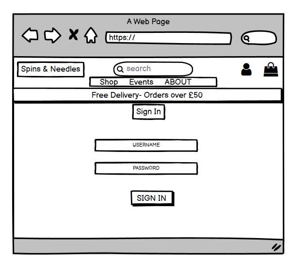

<h1 align="center">Spins & Needles</h1>

## About

***

[Spins & Needles](https://spins-and-needles.herokuapp.com/) is an online e-commerce store selling a range of vinyl records across various music genres. The site offers full CRUD functionality for customers, they can easily add, edit and delete products from their shopping basket and quickly locate what they are looking for using the search bar. New customers benefit from signing up as a user to make use of the profiles page. Here they can pre-save delivery information for seamless checkouts and easily keep track of all their orders in one place. The site also doubles down as an advertisement for the company’s music events which are hosted at their store located in Manchester, this fits perfectly with the theme of the of site and helps attract likeminded people to their events.

## Strategy and planning

***

Why Spins & Needles?

This project was born out of my passion for music and when creating an e-commerce store, I wanted to be able to sell products I was personally invested in but would also be a viable revenue stream in a very crowded online market. 

As streaming platforms gradually took offer the market, physical music copies seem to be dying out, but Vinyl has seen a strong resurgence in recent years. Today, about 85% of mainstream music’s sales are vinyl and Last year saw U.S. revenues exceed $1 billion for the first time since the mid-80s. Ever growing interest from younger people has helped drive this, compared to the average buyer of music, buyers of vinyl records are 57% more likely to be aged under 25. Buyers clearly still appreciate the bonus of physical ownership in a world of streaming music. 

Taking all this information in to account I believe targeting the Vinyl market will help us succeed in our main aim of creating a viable revenue stream. Also, with such a large portion of sales coming from the younger age bracket I think that would offer good longevity, as we can maintain a loyal customer base who can grow with the company. 

Sales are important but we also aim to build a community of likeminded music lovers who can interact with each other. The events page was a big part of this, offering customers a chance to meet each other and enjoy local and international talent. Adding the comments section will encourage customers to interact and help build that community feel. 

One of our main aims throughout was to ensure all customer information was kept secure, and users can have peace of mind when handling payments safely with us. We understand the importance of safely managing data online, which is why we used several defensive programming features in the app to ensure this was done correctly. 

## User Experience (UX)

***

-   ### User stories

    1. As a user, I want to understand the purpose of the website immediately upon opening the site.
    2. As a user, I want to be able to easily navigate the website. 
    3. As a user, I want to be able to view a list of all products and add them to my basket.
    4. As a user, I want to easily view individual product information.
    5. As a user, I want to be able to search for an item.
    6. As a user, I want to be able to select the quantity of an item.
    7. As a user, I want to be able to edit or remove items from my basket.
    8. As a user, I want to see an overview of items in basket and see the total cost of the order.
    9. As a user, I want to be able to enter my payment details and securely checkout.
    10. As a user, I want to get email confirmation when completing an order.
    11. As a user, I want to be able to register as a user.
    12. As a user, I want to be able pre save my delivery information to my profile.
    13. As a user, I want to view my historic orders on my user profile.
    14. As a user, I want to be able to log out. 
    15. As a user, I want to be able to log in.
    16. As a user, I want to be able to view upcoming event details.
    17. As a user, I want to be able engage in the events comments section.

-   ### Site Developer/Owner

    1. As the site developer/owner, I want to be able to add a product with its information to the website
    2. As the site developer/owner, I want to be able to edit a product with its information to the website
    3. As the site developer/owner, I want to be able to delete a product with its information to the website
    4. As the site developer/owner, I want to be able moderate any event comments.

## Layout

***

- I used Balsamiq to structure the layout of my website during the initial design phase.
- I used Bootstraps built in grid system and CSS media queries to make my site responsive across all devices.

### Home page wireframe

### Products(Shop) wireframe

### Product Detail wireframe

### Events wireframe

### Event Detail wireframe

### Bag wireframe

### Checkout wireframe

### Login wireframe

### Register wireframe

### Profile wireframe

## Existing Features and how they align to user stories

***

- __Logo- Links to user story 1 & 2__

  - The head of the page contains the 'Spins & Needles' logo. The logo was designed to represent the websites target audience and purpose.
  - The text content of the logo 'Spins & Needles Records' gives a clear indication immediately that the site is for a record shop. The image of a spinning record included in the logo helps reinforce this and confirms the sites purpose.
  - The logo also serves as a clickable link, allowing users a straightforward way to navigate back to the home page at any time.

- __Home page image gallery-  Links to user story 1 & 2__
  - The image gallery is the main focus on the home page, the images collectively offer an insight into the sites themes and purpose. 
  - The larger images display headings with additional context, they give concise information on what the site offers and invites
  the user to navigate to these sections of the website through clickable links. 

  
- __Search Bar- Links to user story 5__
  - The search bar is always available throughout each page of the site and allows users to easily locate what they are looking for. The placeholder text informs the user of the search criteria.

- __Main Navigation- Links to user story 2__
  - The main nav bar is always available throughout each page of the site, users can easily move from page to page using the clickable links. 

- __Products- Links to user story 3- Links to site owner goal 2 & 3__
  - When users navigate to the shopping page they get a full list of all available products.
  - Each product shows the record image, name, artist and price.
  - The images serve as a clickable link to view the full product detail of each item.
  - The edit and delete options are only shown to the admin when logged in to allow them product management.

- __Product Detail- Links to user story 3, 4 & 6__
  - Each item has its own product detail page where users can display the individual product information for each.
  - On the product details page users can add items to their shopping bag and select the quantity needed.

- __Events- Links to user story 16__
  - When users navigate to the events page they get a full list of all upcoming events.
  - Each event has its own dedicated page which users can navigate to using the event details button.

- __Event Details- Links to user story 16 & 17__
  - Each event has its own page showing the event information and description.
  - The event details page allows users to interact via the comments section, the form allows new comments to be submitted.
  - Existing comments are displayed once approved by the admin, they show the time, date and name of the user who left the comment.

- __About- Links to user story 1__
  - The about section of the website is easily accessible from the navigation bar link and offers clear insight into what the site has to offer
  - The page shows an image of the store itself and gives some information on the background of the company and what the purpose is.

- __Bag- Links to user story 6, 7 & 8__
  - The shopping bag is easily accessible from the navigation bar link. 
  - Users can see an overview of items in basket and see the total cost of the order.
  - Users are able to update the quantity of an item in the bag or remove items altogether.

- __Checkout- Links to user story 9 & 12__
  - Users can navigate to the checkout using the secure checkout button in the bag.
  - A form is available to enter the delivery and contact information.
  - Logged in users have the benefit of saving delivery information to their profiles to be pre filled the next time they shop.
  - Users can easily enter their payment details through the secure payment system in the checkout.

- __Order Confirmation- Links to user story 10__
  - When an order is successfully placed users are taken to the confirmation order page, this gives an overview of the order.
  - Email confirmation is sent to the provided contact email address.

- __Profile- Links to user story 12 & 13__
  - Logged in users can access their profile through the my account drop down section of the main navigation bar.
  - They can maintain their up-to-date delivery information and view their historic orders.
  - Clicking into the order number will show a copy of the confirmation order page.

  

- __Register- Links to user story 11__
  - Users can register for the site to give them access to the profiles page.
  - The registration form is easily accessed through my account drop down section of the main navigation bar.

  

- __Log in- Links to user story 15__
  - Users can access their existing profile information by logging in to the site.
  - The login form is easily accessed through the my account drop down section of the main navigation bar.

  

- __Log Out- Links to user story 14__
  - Logged in users can easily log out at any time.
  - The logout option is easily accessed through the my account drop down section of the main navigation bar.

  

- __Product Management- Links to site owner goal 1__
  - The product management page is only accessible by approved super users, it can be accessed through the my account section of the main navigation bar.
  - This page allows the site admin to add new products directly into the site.

  

- __Edit Product- Links to site owner goal 2__
  - Approved super users can edit any product, the edit option is displayed on each product when the admin is logged in.
  - The edit product form prefills the existing product information and allows the admin to make any changes required.

  

- __Delete Product- Links to site owner goal 3__
  - Approved super users can delete any product, the delete option is displayed on each product when the admin is logged in.
  - The delete button will trigger a modal to open to allow the option to confirm deletion

  
  

- __Moderate Comments- Links to site owner goal 4__
  - Any comment added to the site must first be approved by a super user.
  - The admin can moderate all comments by logging in to the [Django Admin](https://spins-and-needles.herokuapp.com/admin/login/?next=/admin/). This will soon be available in product management as part of the sites future development
  - In the comments section of Django admin there is the option to approve/delete any comment.

  

## Data Schema

***

The above shows the database design followed when building this site, a relational database was used with the PostgreSQL option in Heroku.

[Django Allauth](https://pypi.org/project/django-allauth/) was integrated in to the site to make use of their built in authentication system.

The above design shows the key relationships between the date stored; I will outline some examples shown. The user and the user profile is a 1 to 1 relationship, only 1 user profile is permitted per user. The design also shows how the user primary key is used as a foreign key in the user profile.

The relationship between an event blog post and a blog comment is a one-to-many relationship meaning many comments can go into 1 post. The design again shows how the blog post primary key is used as a foreign key in the blog comments. Another example of this is shown with products and genres, as many products can go into one genre.

## Testing

***

Please refer to seperate [Testing](testing.md) file for full the full breakdown on testing.

## Technologies used

***

- [HTML5](https://en.wikipedia.org/wiki/HTML5)- Markup language.
- [CSS3](https://en.wikipedia.org/wiki/CSS)- Style sheet language.
- [JavaScript](https://en.wikipedia.org/wiki/JavaScript)-  Programming language used to add interactivity to the homepage and implement the logic required to make the app work.
- [Python](https://en.wikipedia.org/wiki/JavaScript)- Backend language used to control the logic on the site.
- [POSTGRESQL](https://en.wikipedia.org/wiki/JavaScript)- Relational Database.
- [Amazon Web Services](https://aws.amazon.com/?nc2=h_lg)- S3 bucket used to host static/media files.
- [stripe](https://stripe.com) - Handles secure payments
- [Django](https://en.wikipedia.org/wiki/Django_(web_framework)) - Used as the framework for the site.
- [Heroku](https://id.heroku.com/login) - Used to deploy and host the live site.
- [Balsamiq](https://balsamiq.com/)- Used to build wireframes.
- [Google Fonts](https://fonts.google.com/)- Sourced the website fonts.
- [Chrome Dev Tools](https://developer.chrome.com/docs/devtools/)- Used to troubleshoot problems with code.
- [Unsplash](https://unsplash.com/photos/1fZC2rYbpsU)- Sourced background image.
- [Gitpod](https://gitpod.io/workspaces)- Integrated development environment (IDE)  Used to write all my code.
- [Git](https://git-scm.com/)- Used for version control.
- [Github](https://github.com/)- Used to host my repository.
- [Beautifier](https://beautifier.io/)- Used to organise code consistently.
- [Font Awesome](https://fontawesome.com/) Large database of icons which I used all over the site to add to the visual language.

## Deployment

***

### Creating The Heroku App

- Register/login on Heroku.
- Click 'New' > 'Create new app'.
- Give the app a name.
- Select the region closest to you.

### Setting up Postgres Database

- On your Heroku app:

- Select 'Resources' tab.

- Search and select 'Heroku Postgres' add-on.

- In your work environment:

- install dj_database_url and psycopg2-binary and update requirements.txt file

- In settings.py:

- import dj_database_url

- Temporarily change your default DATABASES config to: 'default': dj_database_url.parse( YOUR_DATABASE_URL ) using the database URL from your Heroku app config vars. After you apply the migrations, change DATABASES config back, so your database doesn’t end up in version control

- Apply migrations to new database using migrate command in the terminal.

- Create a superuser using createsuperuser command in the terminal.

- In settings.py:

- Connect your project to the postgres database for the live site, and your default database for version control, using the config variable from Heroku by adding if 'DATABASE_URL' in os.environ: DATABASES = {'default': dj_database_url.parse(os.environ.get('DATABASE_URL'))} else: before your default database settings

- Install gunicorn and update requirements.txt file.

- Create Procfile and add web: gunicorn <YOUR_APP_NAME>.wsgi:application

- Temporarily add DISABLE_COLLECTSTATIC to Heroku config vars with value of 1 so Heroku doesn’t try to collect static files when you deploy

- in serrings.py:

- add hostname of your Heroku app to ALLOWED_HOSTS

- Add and commit your changes, then push to Heroku (I used Gitpod so the command was git push Heroku main)

### Setting Up Automatic Deployment From Gitpod

- in Heroku app:

- Select the 'Deploy' tab:

- Choose your deployment method i.e. Gitpod

- Search for your repository

- Click connect

- Enable automatic deploy

### Creating An Account With Amazon Web Services

- Go to AWS website and click 'Create an account'

- Fill in the details and click 'Continue'

- Select 'Personal' account type and fill out details then click 'Create Account and Continue'

- Fill out the credit card details, which will be charged if you go over the free usage limit

- Sign into your new account

### Creating an S3 Bucket 

- Buckets are used to store files for your live site.

- On dashboard, search and open S3

- In Amazon s3:

- Create a new bucket
- Fill in details
- Uncheck 'block all public access'
- Check 'Acknowledge bucket will be public'
- Click 'Create bucket'
- In your new bucket:
- On 'Properties' tab:
- Select 'Static website hosting'
- Check 'Use this bucket to host a website' and fill in default values then click 'Save'
- On 'Permissions' tab:
- Go to 'CORS configuration' section and paste: [{ "AllowedHeaders": ["Authorization"],"AllowedMethods": ["GET"],"AllowedOrigins": ["*"],"ExposeHeaders": []}]
- Go to 'Bucket Policy' section
- Click 'Policy generator' to create a security policy for the bucket
- Select 'S3 Bucket Policy' for Type of Policy
- Enter * in the 'Principal' sections to allow all principals
- Select GetObject in 'Actions' section
- Copy ARN (amazon resource name) from 'Bucket Policy' tab and past into ARN box on Policy   Generator tab
- Click 'Add Statement' > 'Generate Policy'
- Copy and paste th policy into the 'bucket policy editor'
- On the end of 'Resource key' section of the policy add /* to allow access to all resources in the bucket
- Click 'Save'

### Creating An IAM User

- This is used to access your bucket, you will create a group for the user, create an access policy so the group can access you bucket, then assign the user to the group so it can use the policy to access all your files

- On AWS dashboard search and open IAM

- On IAM dashboard:

- On 'Groups' tab:
- Click 'Create New Group', give it a name, then click next till you come to 'Create Group'
- On 'Policies' tab:
- Click 'Create Policy'
- Go to 'JSON' tab
- Click 'import managed policy'
- Search for S3, and import the pre-built 's3 full access' policy
- Get your bucket ARN and paste it twice; once as it is, and once with /* at the end, after "Resource": and in square brackets: [ "<YOUR_BUCKET_ARN>", "<YOUR_BUCKET_ARN>/*" ]
- Click 'Review policy'
- Give it a name and description
- Click 'Create Policy'
- On 'Groups' tab:
- Select your bucket
- Click 'Attach Policy'
- Search, select and attach your newly created policy
- On 'Users' tab:
- Click 'Add User'
- Create a user for your static files
- Check 'Programatic access' box
- Click 'Next' to go to permissions page
- Check the box to select the group you just made
- Click next untill you reach 'Create User'
- Download and save the CSV file by clicking 'Download CSV'. This will contain the users access key and secret access key Once you leave the page you will not be able to return and download the file again

### Connect Django to S3

- In you workspace terminal, install boto3 and django-storages then add to requirements.txt file

- In settings.py:

- Add storages to installed apps
- Add if 'USE_AWS' in os.environ: AWS_STORAGE_BUCKET_NAME = '<YOUR_BUCKET_NAME>' - AWS_S3_REGION_NAME = ''<YOUR_BUCKET_REGION>' AWS_ACCESS_KEY_ID = os.environ.get('AWS_ACCESS_KEY_ID')AWS_SECRET_ACCESS_KEY = os.environ.get('AWS_SECRET_ACCESS_KEY') AWS_S3_CUSTOM_DOMAIN = f'{AWS_STORAGE_BUCKET_NAME}.s3.amazonaws.com'

- In Heroku config vars:

- Add 'USE_AWS' = True, 'AWS_ACCESS_KEY_ID' and 'AWS_SECRET_ACCESS_KEY' variables from the CSV file you downloaded
- Remove 'Disable_COLLECTSTATIC' variable

- Create 'custom_storages.py' file

- Add from django.conf import settings and from storages.backends.23boto3 import s3Boto3Storage
- Add a new class for Static files and one for Media files:
- class StaticStorage(S3Boto3Storage): location = settings.STATICFILES_LOCATION
- class MediaStorage(S3Boto3Storage): location = settings.MEDIAFILES_LOCATION

- Commit your changes and push them to Heroku

- Your S3 bucket should now have a 'static' folder in it with all your static files

- In your bucket:

- Add folder called 'media'
- Add all your media files
- in 'Manage Public Permission' section, select 'grant public read access to these objects'
- Upload
