### Bugs

***
- 

### Validator Testing 

***

There were some issues in code validation when trying to separate JavaScript found in HTML files, into their own script files.
In some instances, the JavaScript has had to have been left in the HTML file, as no solution could be found in moving it and keeping the intended functionality. Where JavaScript could be moved into its own file, there were some further issues now with validating these files. These issues are explained below and are noted in the bugs section for further development.

## CSS Validation

- [W3C CSS Validation](https://validator.w3.org/)- All CSS files were manually inputted in to the validator, no errors are returned. As well as base.css in the spins_and_needles app, CSS files can be found in both the checkout and profile app.

## HTML Validation

- [WC3 Mark Up Validation](https://validator.w3.org/)- All HTML files were manually inputted in to the validator, no errors are returned in all files other than the ones stated below.

- In base.html the JavaScript for the toasts function has been left in this file due to the reasons stated above.
- In checkout.html there is an unresolved 'empty heading' warning from line 132, column 5; to line 132, column 43. This is being used to display the loading spinner when processing payment, I could not find a resolution that would not break this functionality so this has been left again for the reasons stated above.

## JavaScript Validation

- [JS Hint](https://jshint.com/)- All JavaScript files were manually inputted in to the validator, no errors are returned in all files other than the ones stated below.

As mentioned already above and in the bugs section, there were some complications with JavaScript validation. In all 3 instances mentioned below I could not get the files to validate without out breaking the intended functionality. When removing the script tags seen in each JavaScript file mentioned below, the function breaks. However, JS Hint will not validate the files without removing the script tags. I could not find a resolution that would not break this functionality so this has been left again for the reasons stated above.

Impacted files:
- Bag App- update_remove_script.js
- Products App- image_field_edit_script.js
- Products App- image_field_add_script.js

## Python Validation

I used the pep8 validator in GitPod to validate all my python code, no errors are now shown in the problems tab. Instructions
below on how I used this tool:

- Run the command pip3 install pycodestyle, note that this extension may already be installed, in which case this command will do nothing.
- In your workspace, press Ctrl+Shift+P (or Cmd+Shift+P on Mac).
- Type the word linter into the search bar that appears and click on Python
- Select pycodestyle from the list.
- PEP8 errors will now be underlined in red, as well as being listed in the PROBLEMS tab beside your terminal.

### Manual Testing

***

## Development Testing

Test            | Outcome                          | Result
--------------- | -------------------------------- | ------------
Navigation Bar | Do all links navigate to the correct page? | Pass 
Buttons | Does all buttons function as intended? | Pass
User Story 1 | Company logo and image gallery with supported text display on home page | Pass
User story 2 | All site navigation links take you to the intended page | Pass
User Story 3 | View full list of products & add them to the shopping bag | Pass
User story 4 | Clicking product images displays individual product information | Pass
User story 5 | To be able to search for an item | Pass
User story 6 | Select the quantity of an item to buy | Pass
User story 7 | Edit or remove a product from the shopping bag | Pass
User story 8 | View all items in the shopping bag with the total cost of the order. | Pass
User story 9 | Enter my payment details and securely checkout. | Pass
User story 10 | Email confirmation triggered when completing an order. | Pass
User story 11 | Register a user profile | Pass
User story 12 | Pre save my delivery information to my profile. | Pass
User story 13 | view my historic orders on my user profile | Pass
User story 14 | Log out of my user profile | Pass
User story 15 | Log in to my user profile | Pass
User story 16 | View upcoming event details | Pass
User story 17 | Leave a comment on an event post | Pass
User story 18 | Reset the password for my user profile | Pass
User story 19 | Receive feedback on all actions I make on the site | Pass
Site Owner Goal 1 | Add a new product to the site through product management and get confirmation | Pass
Site Owner Goal 2 | Edit an existing product on to the site through the edit product form and get confirmation | Pass
Site Owner Goal 3 | Delete a product using the delete button shown against each product | Pass
Site Owner Goal 4 | Approve or delete comments in the admin | Pass
Site Owner Goal 5 | Add/edit/delete events in the admin | Pass
Responsiveness | Is the application responsive across all devices? | Pass
Accessibility | Is the application accessible to all users? | Pass 
Error Handling | Do error handlers function? | Pass

## Development Testing

Test            | Outcome                          | Result
--------------- | -------------------------------- | ------------
Full checks against development version | Were all development testing criteria still passed once the site was deployed, with no errors showing? | Pass
Visual Checks | Are all images of usable resolution, all text unobscured and undistracted foregrounds? | Pass
Code checked | No errors showing in the code? | Pass (unfixed issues explained in code validation and bugs sections)
Console errors | No console errors showing? | Pass
Security | Can only approved admin user add/edit/delete a product? Can only the approved admin acccess the Django Admin Portal? | Pass
Error Handling | Does the application gracefully handle errors? Can you navigate back to site from an error page? | Pass 
Error Handling | Users cannot break the site using URL manipulation? | Pass
Links | There are no broken links, all work as intended | Pass

### Automated Testing

***

My automated testing skills are very much still in development themselves. Due to this I decided to focus more so on robust manual testing of the site which covers all bases. I carried out some automated testing, however this is something I intend to explore further in the sites future development given more time. 

Here are the automated tests I ran; each test checks the view is rendering the correct template. These tests have been evidenced through each of their commit messages linked below:

- [Bag App Test](https://github.com/JackDilger/spins-and-needles-ms4/commit/47c915bd209b0f44070f705cce7109b775455e25)
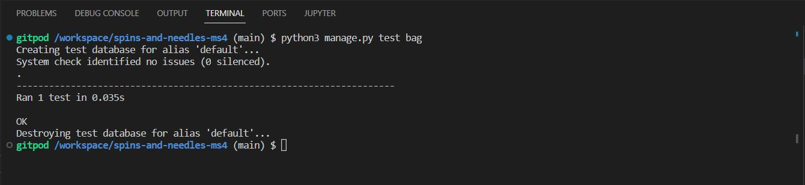

- [Home App Test](https://github.com/JackDilger/spins-and-needles-ms4/commit/dbe1672fbe05b08b8b87eea77f44aa62ebd78ffc)
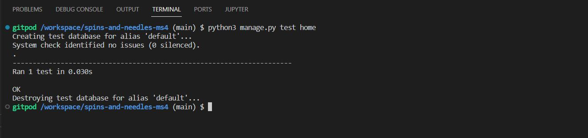

- [Products App Test](https://github.com/JackDilger/spins-and-needles-ms4/commit/4b662fe9d615aaf61e8af2b36ccf9cef59072328)
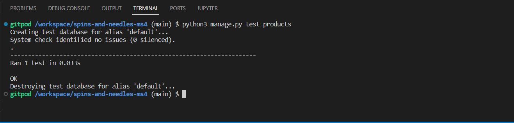

### Accessibility Testing

***

I have used the chrome developer tool extension [Lighthouse](https://web.dev/measure/) to evaluate my sites accessibility. To provide a good user experience lighthouse recommends sites should strive to have a good score (90-100). All pages on the site have a 100% score in lighthouse, the same as shown here on the home page.

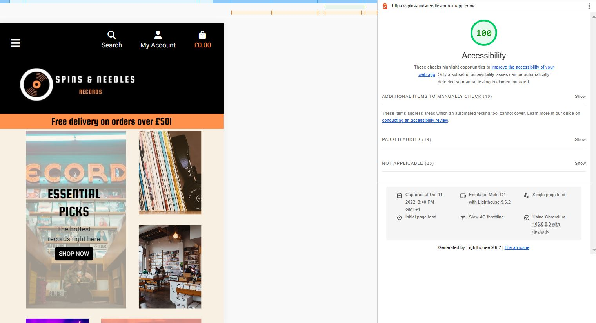

### Browser Testing

***

- I tested the site across multiple browsers which all worked.
  - Chrome
  - Safari
  - Edge
  - Firefox
  - Opera

### Device Responsiveness Testing

***

- I manually tested the site across different device operating systems which all worked.
  - The latest version of iOS and iPadOS is 15.5.
  - The latest version of Android OS 12
  - Windows PC
  - MacBook

- I used chrome dev tools to manually test the sites responsiveness across a range of devices which all worked. Devices include:
  - iphone 5-12
  - iphone SE
  - iphone XR
  - iphone 12 PRO
  - Pixel 5
  - Galaxy S8+
  - Galaxy S20 Ultra
  - Galaxy A51/71
  - Galaxy Fold
  - ipad Air
  - ipad Mini
  - Surface Pro 7
  - Surface Pro Duo
  - Windows PC
  - MacBook
  - Nest Hub
  - Nest Hub Max
  
  ## Images from responsive tests

- Home Page
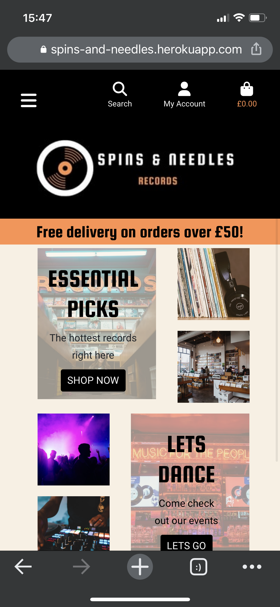

- Products Page

- Products Page
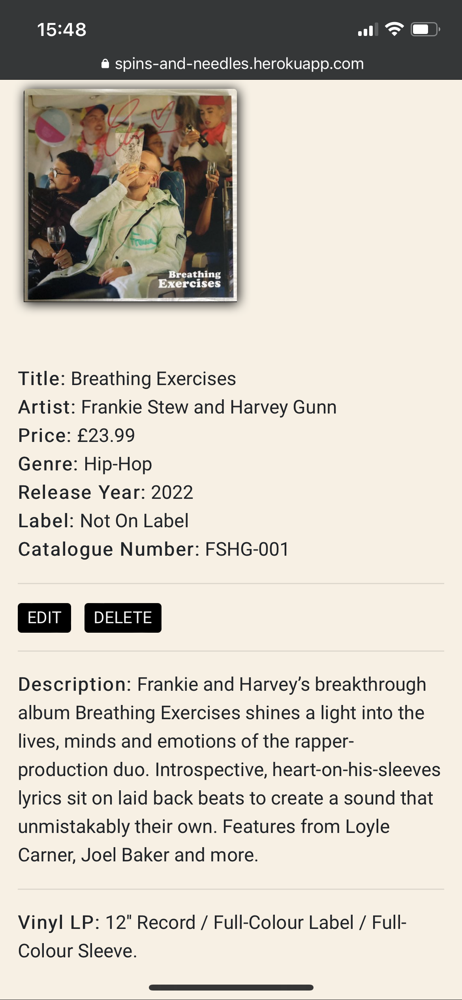

- Events Page

- Comments Page
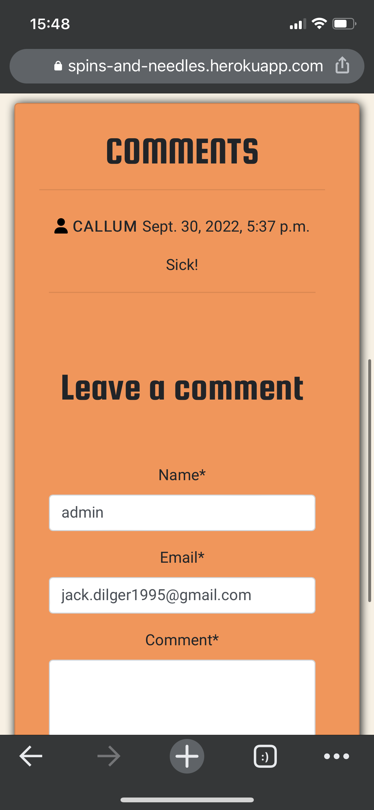

- About Page
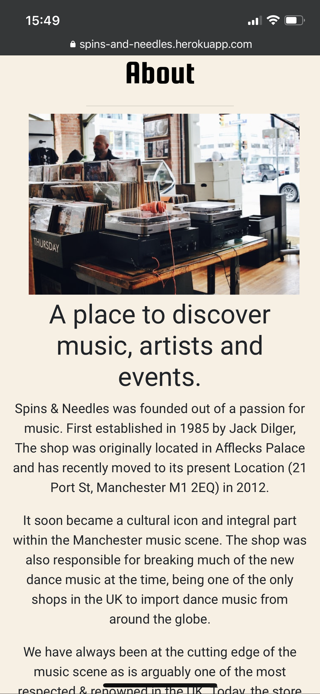

- Sign in Page
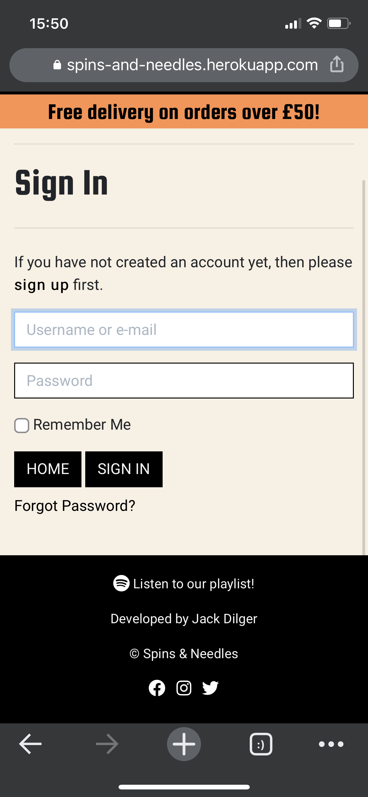

- Bag Page
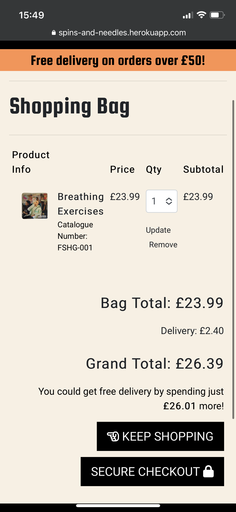

- Checkout Page
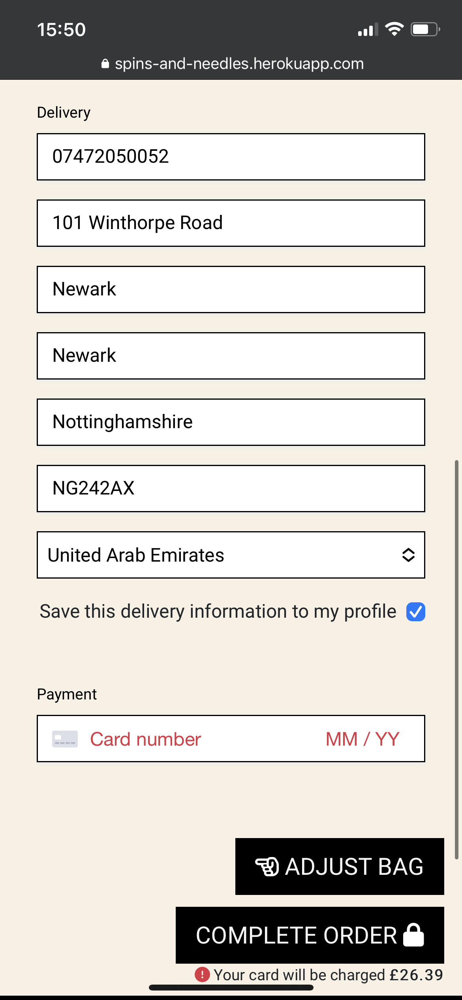

- Product Management Page
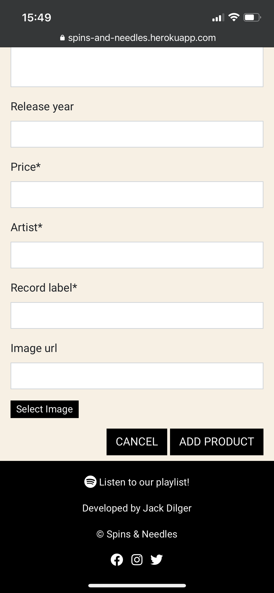

- Profile Page
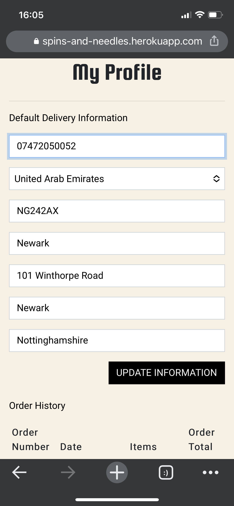

- Register Page
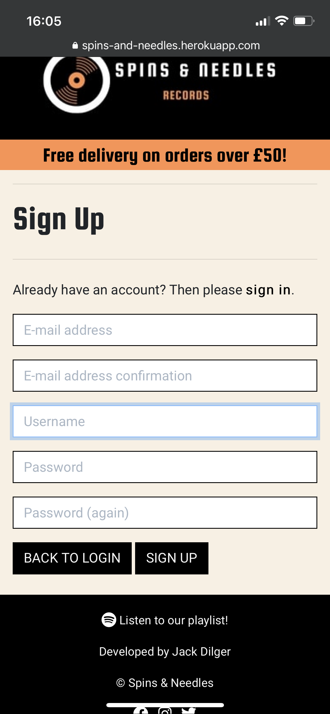

- Order Confirmation Page
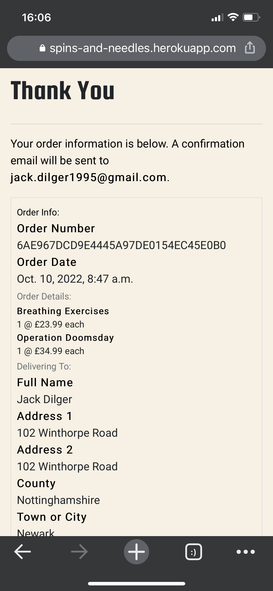
